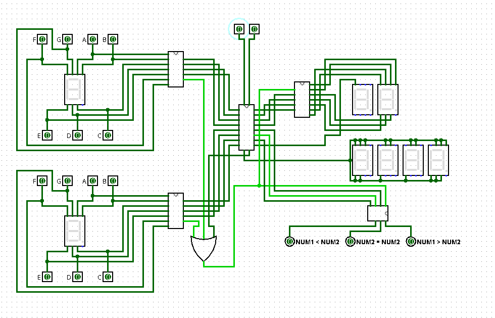
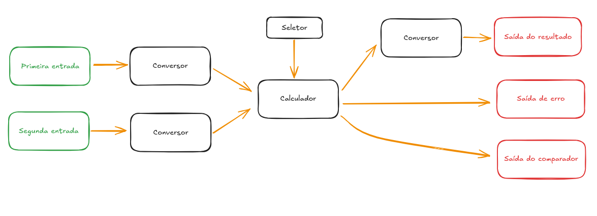
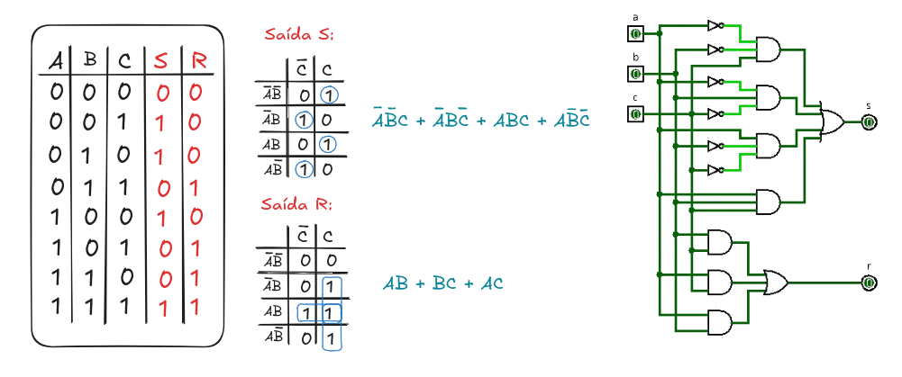
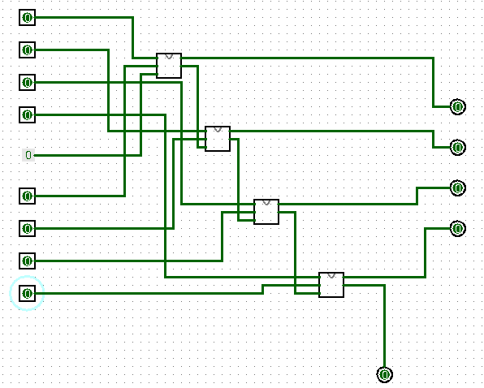
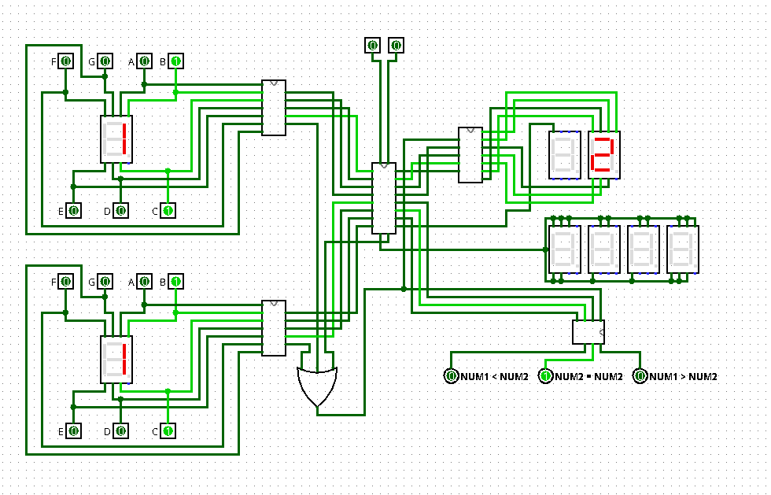
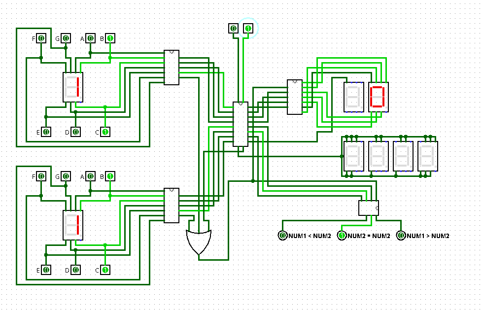
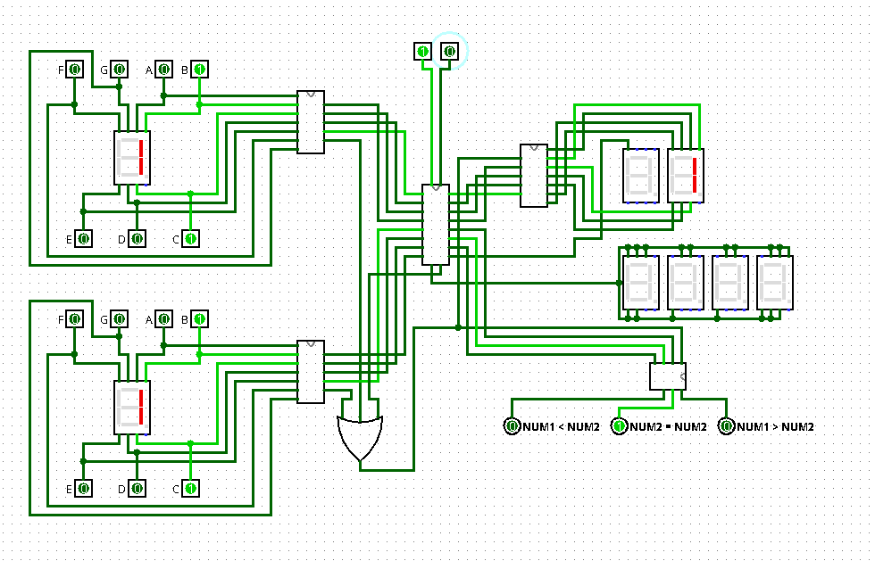
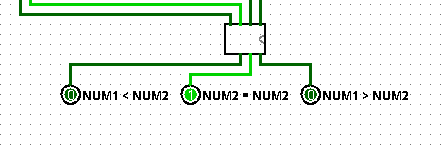

# Calculadora Lógica em Logisim

## 1. Descrição do Circuito

Este projeto consiste na implementação de uma calculadora que realiza operações aritméticas básicas (soma, subtração, multiplicação) exibindo o resultado em displays de 7 segmentos e compara dois números em formato hexadecimal. A calculadora foi desenvolvida no simulador Logisim durante as aulas de Circuitos Digitais.

### Funcionamento
O circuito recebe dois números de entrada em formato hexadecimal, que são inseridos manualmente através de dois displays de 7 segmentos, o usuário deve utlizar os botões parar ligar cada segmento do display até formar o número desejado. Para escolher a operação, o usuário irá utilizar uma espécie de "seletor" feito com dois botões, para isso deve digitar um número de 0 à 2 em binário, onde  0 equivale a soma, 1 à subtração e 2 equivale a multiplicação. O resultado é exibido em um display de 7 segmentos, também em formato hexadecimal, caso o resultado seja negativo também será exibido em outro display de 7 segmentos o sinal negativo. Caso o resultado ultrpasse os limites do display de 7 segmentos, será impresso a palavra "erro" em um conjunto de outros 4 displays de 7 segmentos. Quanto ao comparador, há 3 pinos de testes, onde cada um recebe uma especificação (num1 < num2; num1 = num2; num1 > num2), ambos por padrão o valor 0, ao inserir os números, a comparação correta irá imprimir 1 no pino da especificação correta.  

## 2. Diagramas-

### Diagrama Geral

O circuito foi dividido em quatro módulos principais:
1. **Entrada dos números**: Dois módulos de entrada com displays de 7 segmentos para a inserção manual dos números operando.
2. **Conversor da entrada**: Um módulo converte as entradas para hexadecimal.
3. **Calculador**: Um módulo que permitem realizar o processamento das operações e com um seletor para escolher qual operação visualizar.
4. **Conversor da saída**: Um módulo para converter a saída de hexadecimal para o display de 7 segmentos.

### Diagrama da soma

Utilizando quatro circuitos de soma de 1 bit, é possível realizar a operação completa de soma entre dois números binários de 4 bits cada um. os bits individuais de cada número são somados entre si e com o "vai um" que foi resultado da soma dos bits anteriores de cada número. Assim, cada circuito de soma de 1 bit possui trẽs entradas (Um bit de cada número binário que será somado e o "vai um" da operação anterior) e duas saídas (o resultado da soma dos dois bits e o "vai um" que será adicionado à próxima operação).

## 3. Testes

### Metodologia

Os testes foram realizados no Logisim, com todas as combinações de entradas (0 a F) e operações sendo verificadas. O comportamento esperado foi obtido para cada operação.

#### Exemplos de Testes

1. **Soma**:
   - Operandos: 1 e 1 (hexadecimal)
   - Resultado esperado: 2
   - Resultado obtido: 2 (hexadecimal)
   
   

2. **Subtração**:
   - Operandos: 1 e 1
   - Resultado esperado: 0
   - Resultado obtido: 0 (hexadecimal)

   

3. **Multiplicação**:
   - Operandos: 1 e 1
   - Resultado esperado: 1
   - Resultado obtido: 1 (hexadecimal)

   

4. **Comparação**:
   - Operandos: 1 e 1
   - Resultado esperado: 1 = 1
   - Resultado obtido: pino "NUM1 = NUM2" aceso

   

### Resultados Finais

Os testes demonstraram que o circuito funciona corretamente para todas as operações, exibindo os resultados em hexadecimal e indicando corretamente as comparações entre os números.
